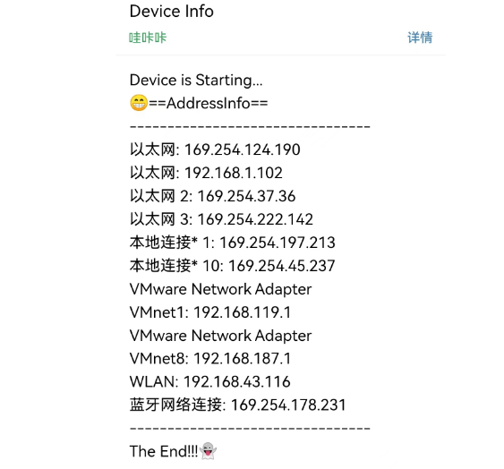

# PorAddress

Power On Report Address

## 一、Brief

Some devices need to know the IP address before they can connect remotely.

This program enables the device to obtain its own IP address information and report it via email automatically.

## 二、Start automatically

Service File :  /etc/systemd/system

```shell
[Unit]     				
Description=demo						#当前配置文件的描述信息
After=network.target nginx.service		#表示当前服务是在那个服务后面启动，一般定义为网络服务启动后启动
 
[Service]
WorkingDirectory=/home/test     			#工作目录				
Type=forking			                  	#定义启动类型 
ExecStart=/home/test/demo-start.sh 	       	#定义启动进程时执行的命令。
ExecReload=/home/test/demo-restart.sh      	#重启服务时执行的命令
ExecStop=/home/test/demo-stop.sh		   	#定义关闭进程时执行的命令。
PrivateTmp=true							   	#是否分配独立空间
Restart=always
RestartSec=5
StartLimitInterval=0
StartLimitBurst=5
 
[Install]
WantedBy=multi-user.target    	#表示多用户命令行状态
```

cmd

```shell
systemctl enable demo.service         		#设置开机自启
systemctl start demo.service              	#启动服务
systemctl status demo.service             	#服务详细信息
```

- http://t.csdn.cn/v0lwO

- http://t.csdn.cn/Npz6J

## 三、Display

